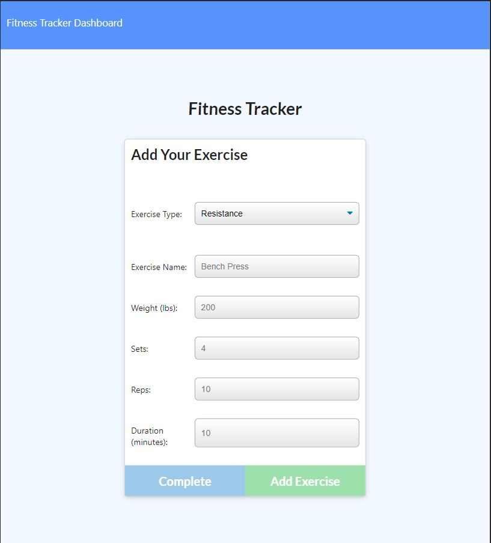

# fitness-tracker 

## Purpose

This fitness tracker app lets a user create, view and track their daily workouts. It allows them to log multiple exercises which tracks the name, type, weight, sets, reps and duration of the exercises. It can also track the user's distance traveled based on their cardio exercise.

## Screenshot

## Links

Heroku: https://intense-basin-38628.herokuapp.com/

GitHub: https://github.com/fongvang09/fitness-tracker
